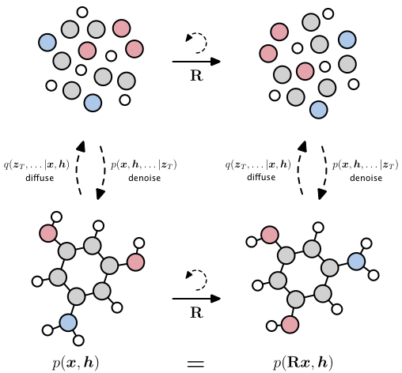
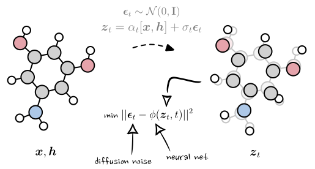

# EDM: E(3) Equivariant Diffusion Model for Molecule Generation in 3D.



Official code release for the paper Equivariant Diffusion for Molecule Generation in 3D.

**If** you want to set-up a rdkit environment, it may be easiest to install conda and run:
``conda create -c conda-forge -n my-rdkit-env rdkit``

and then install the other required packages from there. The code should still run without rdkit installed though.


### Training the EDM:

```python main_qm9.py --n_epochs 3000 --exp_name edm_qm9 --n_stability_samples 1000 --diffusion_noise_schedule polynomial_2 --diffusion_noise_precision 1e-5 --diffusion_steps 1000 --diffusion_loss_type l2 --batch_size 64 --nf 256 --n_layers 9 --lr 1e-4 --normalize_factors [1,4,10] --test_epochs 20 --ema_decay 0.9999```


A visualization of what happens during training:




### After training

To analyze the sample quality of molecules

```python eval_analyze.py --model_path outputs/edm_qm9 --n_samples 10_000```

To visualize some molecules

```python eval_sample.py --model_path outputs/edm_qm9 --n_samples 10_000```


### For GEOM-Drugs

First follow the intructions at data/geom/README.md to set up the data.

Training
```python main_geom_drugs.py --n_epochs 3000 --exp_name edm_geom_drugs --n_stability_samples 500 --diffusion_noise_schedule polynomial_2 --diffusion_steps 1000 --diffusion_noise_precision 1e-5 --diffusion_loss_type l2 --batch_size 64 --nf 256 --n_layers 4 --lr 1e-4 --normalize_factors [1,4,10] --test_epochs 1 --ema_decay 0.9999 --normalization_factor 1 --model egnn_dynamics --visualize_every_batch 10000```


Analyze

```python eval_analyze.py --model_path outputs/edm_geom_drugs --n_samples 10_000```

Sample

```python eval_sample.py --model_path outputs/edm_geom_drugs```


Small note: The GPUs we used for these experiment were pretty large. If the memory does not fit, try running at a smaller size. The main reason is that the EGNN runs with fully connected message passing, which becomes very memory intensive.

### For Conditional Generation

#### Train a Conditional EDM

```python main_qm9.py --exp_name exp_cond_alpha  --model egnn_dynamics --lr 1e-4  --nf 192 --n_layers 9 --save_model True --diffusion_steps 1000 --sin_embedding False --n_epochs 3000 --n_stability_samples 500 --diffusion_noise_schedule polynomial_2 --diffusion_noise_precision 1e-5 --dequantization deterministic --include_charges False --diffusion_loss_type l2 --batch_size 64 --normalize_factors [1,8,1] --conditioning alpha --dataset qm9_second_half```

The argument `--conditioning alpha` can be set to any of the following properties: `alpha`, `gap`, `homo`, `lumo`, `mu` `Cv`. The same applies to the following commands that also depend on alpha.

#### Generate samples for different property values

```python eval_conditional_qm9.py --generators_path outputs/exp_cond_alpha --property alpha --n_sweeps 10 --task qualitative```

You can set `--generators_path` arguments to `outputs/exp_35_conditional_nf192_9l_alpha` to use our pre-trained model on alpha.


#### Train a property classifier network 
```cd qm9/property_prediction```  
```python main_qm9_prop.py --num_workers 2 --lr 5e-4 --property alpha --exp_name exp_class_alpha --model_name egnn```

Additionally, you can change the argument `--model_name egnn` by `--model_name numnodes` to train a classifier baseline that classifies only based on the number of nodes.

#### Evaluate the property classifier on EDM
Evaluate the trained property classifier on the samples generated by the trained EDM model

```python eval_conditional_qm9.py --generators_path outputs/exp_cond_alpha --classifiers_path qm9/property_prediction/outputs/exp_class_alpha --property alpha  --iterations 100  --batch_size 100 --task edm```

To use a pre-trained generator and classifier model for alpha you can use the following arguments: `--generators_path outputs/exp_35_conditional_nf192_9l_alpha` and `--classifiers_path qm9/property_prediction/outputs/exp_class_alpha_pretrained`


